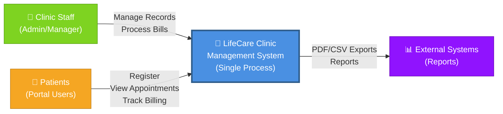
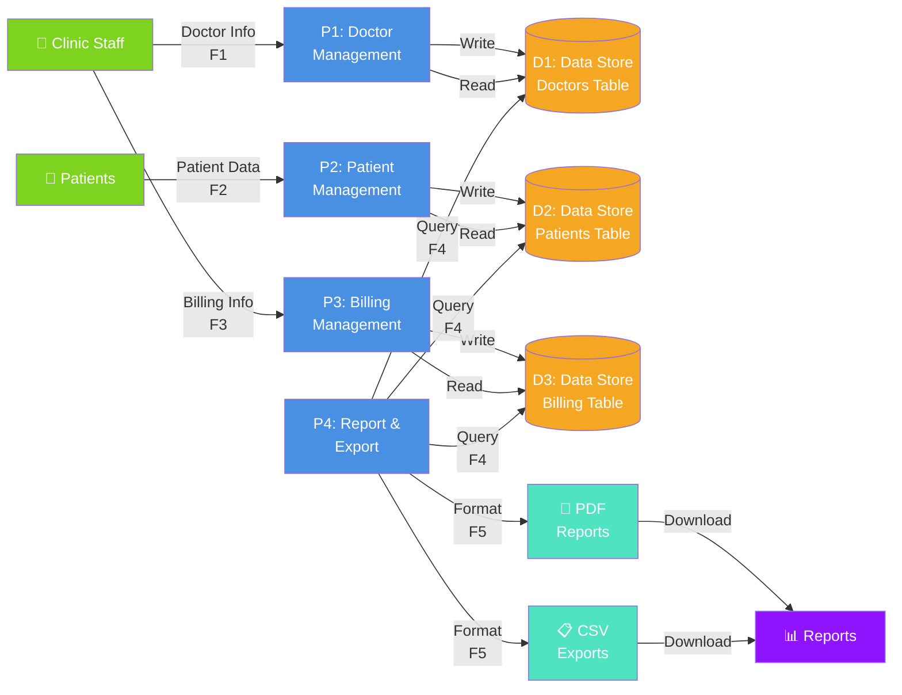
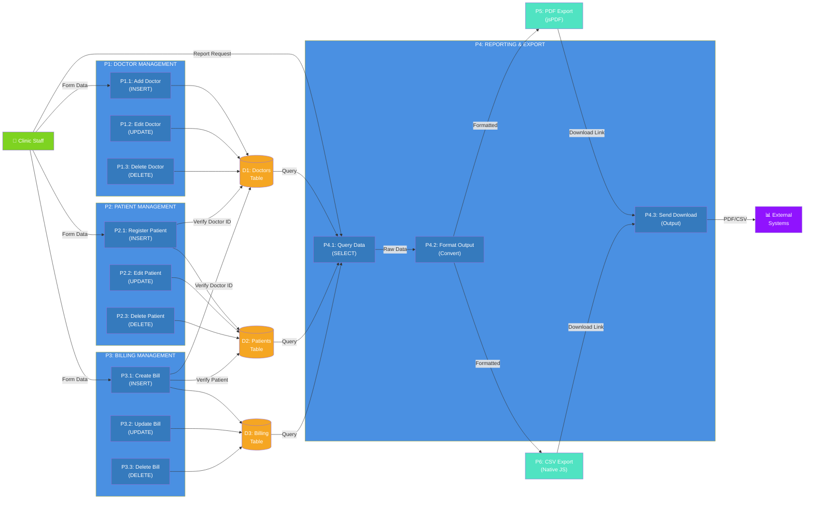

# LifeCare Clinic Management System

A lightweight, web-based clinic management system for handling doctors, patients, and billing operations. Built with Python HTTP server, SQLite database, and vanilla JavaScript frontend.

## Overview

LifeCare provides a user-friendly platform for:
- Managing doctor profiles (specialization, contact details)
- Registering and tracking patient appointments
- Processing and tracking billing records
- Generating reports and exporting data to PDF/CSV

## Quick Start

```bash
# Run the server
python app.py

# Access the application
# Open http://localhost:8000 in your browser
```

The system automatically initializes the SQLite database on first run.

---

## Data Flow Diagrams

### Level 0: Context Diagram
**High-level System Overview - External Entity Perspective**

```
                                    ┌─────────────────────────┐
                                    │   LifeCare Clinic       │
                                    │  Management System      │
                                    │  (Single Process)       │
                                    └─────────────────────────┘
                                             │
                    ┌────────────────────────┼────────────────────────┐
                    │                        │                        │
                    ▼                        ▼                        ▼
            ┌─────────────────┐    ┌─────────────────┐    ┌─────────────────┐
            │  Clinic Staff   │    │    Patients     │    │  External Data  │
            │                 │    │  (Portal User)  │    │   (Reports)     │
            │ - View Data     │    │                 │    │                 │
            │ - Manage Records│    │ - Register      │    │ - PDF Export    │
            │ - Process Bills │    │ - View Appts    │    │ - CSV Export    │
            └─────────────────┘    │ - Track Billing │    └─────────────────┘
                    │              └─────────────────┘              │
                    │                       │                       │
                    └───────────────────────┼───────────────────────┘
                                            │
                    ┌───────────────────────┴───────────────────────┐
                    │  System maintains: Doctors, Patients, Bills   │
                    │  & generates export reports on demand        │
                    └───────────────────────────────────────────────┘
```

**External Entities:**
- **Clinic Staff**: Creates/edits doctor and patient records, processes billing
- **Patients**: Register for appointments, view their appointment details
- **Report System**: Extracts and exports data to PDF/CSV formats

---

### Level 1: Data Flow Diagram (Main Processes)
**System Decomposed into Major Functional Areas**

```
    ┌────────────┐              ┌────────────┐              ┌────────────┐
    │ Clinic     │              │  Patients  │              │ Billing    │
    │ Staff      │              │  Portal    │              │ Admin      │
    └──────┬─────┘              └──────┬─────┘              └──────┬─────┘
           │                           │                           │
           │                           │                           │
           ▼                           ▼                           ▼
    ┌─────────────────────────────────────────────────────────────────────┐
    │                                                                       │
    │  P1: Doctor         │  P2: Patient         │  P3: Billing           │
    │  Management         │  Management          │  Management            │
    │                     │                      │                        │
    │  - Add/Edit/Delete  │  - Register New      │  - Create Bill         │
    │    Doctor Records   │  - Edit Appt Info    │  - Track Payments      │
    │  - Store in DB      │  - Link to Doctor    │  - Delete Records      │
    │                     │  - Store in DB       │  - Store in DB         │
    │                     │                      │                        │
    └─────────────────────────────────────────────────────────────────────┘
           │                    │                           │
           │                    │                           │
           └────────────────────┼───────────────────────────┘
                                │
                                ▼
                    ┌──────────────────────┐
                    │   Data Stores (D1)   │
                    │  - Doctors Table     │
                    │  - Patients Table    │
                    │  - Billing Table     │
                    │  - SQLite DB         │
                    └──────────────────────┘
                                │
                                ▼
                    ┌──────────────────────┐
                    │  P4: Report & Export │
                    │                      │
                    │  - Query Data        │
                    │  - Format PDF/CSV    │
                    │  - Send to User      │
                    └──────────────────────┘
                                │
                    ┌───────────┴───────────┐
                    ▼                       ▼
            ┌──────────────┐        ┌──────────────┐
            │ PDF Reports  │        │ CSV Exports  │
            └──────────────┘        └──────────────┘
```

**Major Data Flows in Level 1:**
- **F1**: Doctor info (name, specialization, contact) → P1 → D1
- **F2**: Patient data (name, contact, appointment date, doctor_id) → P2 → D1
- **F3**: Billing info (patient_name, doctor_id, contact, amount) → P3 → D1
- **F4**: Query requests → P4 → D1 (retrieves data)
- **F5**: Formatted reports → P4 → External systems (PDF/CSV)

---

### Level 2: Detailed Data Flow Diagram (Sub-processes & Granular Operations)
**Detailed Decomposition of Core Processes**

```
╔═══════════════════════════════════════════════════════════════════════╗
║           P1: DOCTOR MANAGEMENT (Decomposed)                         ║
╠═══════════════════════════════════════════════════════════════════════╣
║                                                                       ║
║  P1.1: Add Doctor        │  P1.2: Edit Doctor      │  P1.3: Delete  ║
║  ─────────────────       │  ──────────────────      │  ─────────     ║
║  Input: Form Data        │  Input: ID + New Data   │  Input: ID     ║
║  → Validate              │  → Fetch Current        │  → Verify Ref  ║
║  → INSERT SQL            │  → UPDATE SQL           │  → DELETE SQL  ║
║  → Return ID             │  → Return Status        │  → Return OK   ║
║                          │                         │                ║
╚═══════════════════════════════════════════════════════════════════════╝
    │                           │                           │
    └───────────────────────────┼───────────────────────────┘
                                ▼
                        ┌──────────────────┐
                        │  D1: Doctors     │
                        │  ────────────    │
                        │ - ID (PK)        │
                        │ - Name           │
                        │ - Specialization │
                        │ - Contact        │
                        └──────────────────┘

╔═══════════════════════════════════════════════════════════════════════╗
║           P2: PATIENT MANAGEMENT (Decomposed)                        ║
╠═══════════════════════════════════════════════════════════════════════╣
║                                                                       ║
║  P2.1: Register Patient   │ P2.2: Edit Patient    │  P2.3: Delete   ║
║  ─────────────────────    │ ──────────────────    │  ──────────     ║
║  Input: Registration Form │ Input: ID + New Data  │  Input: ID      ║
║  → Validate               │ → Fetch from D1       │  → Verify Ref   ║
║  → Check Doctor ID (D1)   │ → Validate Doctor ID  │  → DELETE SQL   ║
║  → INSERT SQL             │ → UPDATE SQL          │  → Return OK    ║
║  → Return Confirmation    │ → Return Status       │                 ║
║                           │                       │                 ║
╚═══════════════════════════════════════════════════════════════════════╝
    │                           │                           │
    └───────────────────────────┼───────────────────────────┘
                                ▼
                        ┌──────────────────┐
                        │  D2: Patients    │
                        │  ────────────    │
                        │ - ID (PK)        │
                        │ - Name           │
                        │ - Contact        │
                        │ - Appt Date      │
                        │ - Doctor_ID (FK) │──→ References D1
                        └──────────────────┘

╔═══════════════════════════════════════════════════════════════════════╗
║           P3: BILLING MANAGEMENT (Decomposed)                        ║
╠═══════════════════════════════════════════════════════════════════════╣
║                                                                       ║
║  P3.1: Create Bill        │  P3.2: Update Bill    │  P3.3: Delete   ║
║  ──────────────────       │  ──────────────────   │  ──────────     ║
║  Input: Billing Form      │  Input: ID + New Data │  Input: ID      ║
║  → Validate Amount        │  → Fetch from D1      │  → Verify Ref   ║
║  → Check Patient (D2)     │  → Fetch from D2      │  → DELETE SQL   ║
║  → Check Doctor (D1)      │  → UPDATE SQL         │  → Return OK    ║
║  → INSERT SQL             │  → Return Status      │                 ║
║  → Return Confirmation    │                       │                 ║
║                           │                       │                 ║
╚═══════════════════════════════════════════════════════════════════════╝
    │                           │                           │
    └───────────────────────────┼───────────────────────────┘
                                ▼
                        ┌──────────────────┐
                        │  D3: Billing     │
                        │  ────────────    │
                        │ - ID (PK)        │
                        │ - Patient_Name   │
                        │ - Doctor_ID (FK) │──→ References D1
                        │ - Contact        │
                        │ - Amount         │
                        └──────────────────┘

╔═══════════════════════════════════════════════════════════════════════╗
║           P4: REPORTING & EXPORT (Decomposed)                        ║
╠═══════════════════════════════════════════════════════════════════════╣
║                                                                       ║
║  P4.1: Query Data         │  P4.2: Format Output  │  P4.3: Send     ║
║  ───────────────          │  ────────────────     │  ──────────     ║
║  Input: Request Type      │  Input: Raw Data      │  Input: Format  ║
║  → SELECT * FROM Table    │  → Parse Arrays       │  → Write File   ║
║  → Fetch All Records      │  → jsPDF/CSV Format   │  → Download     ║
║  → Filter if Needed       │  → Structure Headers  │  → Return Link  ║
║  → Return JSON Array      │  → Return Formatted   │                 ║
║                           │                       │                 ║
╚═══════════════════════════════════════════════════════════════════════╝
    │                           │                           │
    └───────────────────────────┼───────────────────────────┘
                                │
                    ┌───────────┴───────────┐
                    ▼                       ▼
            ┌──────────────────┐    ┌──────────────────┐
            │ P5: PDF Export   │    │ P6: CSV Export   │
            │ ──────────────── │    │ ──────────────── │
            │ - jsPDF Library  │    │ - Native JS      │
            │ - Auto-table     │    │ - Comma Separated│
            │ - Styled Output  │    │ - Plain Text     │
            └──────────────────┘    └──────────────────┘
```

**Detailed Data Flows in Level 2:**
- **F1.1**: Doctor form → P1.1 → SQL INSERT → D1
- **F1.2**: Doctor ID + Updated Data → P1.2 → SQL UPDATE → D1
- **F2.1**: Patient form + Doctor_ID → P2.1 → Verify D1 → SQL INSERT → D2
- **F3.1**: Billing form + Doctor_ID → P3.1 → Verify D1 & D2 → SQL INSERT → D3
- **F4.1**: Report request → P4.1 → Query D1/D2/D3
- **F4.2**: Raw data → P4.2 → Format conversion (JSON → PDF/CSV)
- **F4.3**: Formatted output → Client download

---

### Diagram Images - Mermaid Format

#### Level 0: Context Diagram (High-Level System Overview)

This level acts as a high-level overview, representing the entire system as a single process, showing its interaction with external entities, input, and output. It is designed for a broad, non-technical audience to understand the system's boundary.



---

#### Level 1: Data Flow Diagram (Main Processes & Data Stores)

This level breaks down the single, main process from the Level 0 diagram into major sub-processes, displaying the main functional areas, major data stores, and how data moves between them.



**Major Data Flows in Level 1:**
- **F1**: Doctor info (name, specialization, contact) → P1 → D1
- **F2**: Patient data (name, contact, appointment date, doctor_id) → P2 → D2
- **F3**: Billing info (patient_name, doctor_id, contact, amount) → P3 → D3
- **F4**: Query requests → P4 → D1/D2/D3 (retrieves data)
- **F5**: Formatted reports → P4 → External systems (PDF/CSV)

---

#### Level 2: Detailed Data Flow Diagram (Sub-processes & Granular Operations)

This level provides further decomposition of the sub-processes in Level 1 into finer, more granular, and detailed sub-processes. It is useful for complex systems requiring deep technical detail.




**Detailed Data Flows in Level 2:**
- **F1.1**: Doctor form → P1.1 (Validate) → SQL INSERT → D1
- **F1.2**: Doctor ID + Updated Data → P1.2 (Validate) → SQL UPDATE → D1
- **F1.3**: Doctor ID → P1.3 (Verify References) → SQL DELETE → D1
- **F2.1**: Patient form + Doctor_ID → P2.1 (Verify Doctor in D1) → SQL INSERT → D2
- **F2.2**: Patient ID + Updated Data → P2.2 (Validate) → SQL UPDATE → D2
- **F2.3**: Patient ID → P2.3 (Verify References) → SQL DELETE → D2
- **F3.1**: Billing form + IDs → P3.1 (Verify D1 & D2) → SQL INSERT → D3
- **F3.2**: Billing ID + Updated Data → P3.2 (Validate) → SQL UPDATE → D3
- **F3.3**: Billing ID → P3.3 (Verify References) → SQL DELETE → D3
- **F4.1**: Report request → P4.1 → Query all tables from D1/D2/D3
- **F4.2**: Raw data (JSON) → P4.2 → Format conversion (PDF/CSV structure)
- **F4.3**: Formatted output → P4.3 → Client download link


## System Architecture Summary

| Component | Type | Responsibility |
|-----------|------|-----------------|
| [app.py](app.py) | Backend | HTTP server, route handling, request dispatch |
| [database.py](database.py) | Backend | SQLite operations, CRUD logic, data persistence |
| [static/js/](static/js/) | Frontend | Fetch API calls, table rendering, user interactions |
| [templates/](templates/) | Frontend | HTML structure, form layouts, navigation |
| [static/css/style.css](static/css/style.css) | Frontend | Styling, responsive design |

## Technology Stack

- **Backend**: Python 3 (http.server, sqlite3)
- **Database**: SQLite
- **Frontend**: Vanilla JavaScript (fetch API)
- **Export**: jsPDF, native CSV export
- **Styling**: CSS3 (responsive design)